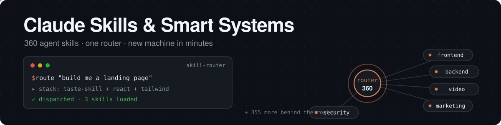

[](SKILLS-INDEX.md)
[](LICENSE)
[](PORTING.md)
[](https://github.com/Zuhair-01/claude-skills-and-systems)
[](https://github.com/Zuhair-01/claude-skills-and-systems/commits/main)
[](PORTING.md)

# Claude Skills & Smart Systems — 360 Agent Skills for Claude Code

## 60-second quickstart

```bash
git clone https://github.com/Zuhair-01/claude-skills-and-systems.git
cd claude-skills-and-systems
./install.sh --pack starter        # router + search + debug + review + ship (recommended first)
./install.sh                       # ...or everything (symlinked, updates flow through)
./install.sh --list-packs          # frontend backend ai-agents video marketing devops security qa starter
```

Windows (PowerShell): `.\install.ps1` / `.\install.ps1 -Pack frontend`.
Then paste [`ROUTING.md`](ROUTING.md) into your `CLAUDE.md` so the agent actually *uses* the library — that's the step that turns 360 folders into a system.

A production-grade library of **360 agent skills** plus the routing systems that make them work together — built for bootstrapping a new Claude Code setup on a new device in minutes.

Every skill is a folder with a `SKILL.md` (the instruction file the agent loads) plus its scripts, references, and templates. Drop the folder into your skills directory and the capability is installed. No framework to learn, no daemon to run.

## Start here

| I want to… | Read this |
|---|---|
| Route any task to the right skill automatically | `skills/skill-router/` |
| Search all 360 skills by keyword | `skills/overseer/` (`python search.py <keywords>`) |
| Plan before building | `skills/plan-ceo-review/`, `skills/plan-eng-review/`, `skills/office-hours/` |
| Debug systematically | `skills/systematic-debugging/`, `skills/investigate/` |
| Ship safely | `skills/ship/`, `skills/review/`, `skills/qa/` |
| Keep copy human | `skills/humanizer/` |
| Set up this repo on a fresh machine | `PORTING.md` |
| Browse everything by category | `SKILLS-INDEX.md` |

## Categories

| Category | Count | Highlights |
|---|---|---|
| Frontend / UI | 35 | taste-skill, design-system, tailwind-patterns, shadcn, react-*, nextjs-*, motion-ui, threejs, visual-to-code, redesign-skill |
| Backend / API / DB | 35 | fastapi-patterns, django-patterns, laravel-patterns, api-design, graphql, prisma-patterns, postgres-patterns, redis-patterns |
| Languages | 15 | python-pro, rust-pro, golang-pro, java-pro, typescript-*, sql-pro, bash-pro |
| Mobile | 12 | ios-qa, ios-developer, swiftui-patterns, android-clean-architecture, flutter-expert, react-native-architecture |
| AI / Agents / LLM | 25 | agent-orchestrator, kyros-orchestrator, llm-app-patterns, rag-implementation, eval-harness, mcp-builder, prompt-engineering |
| Video / Audio / UGC factory | 55 | hyperframes* (9), heygen-* (4), seedance-*, ugc-video-auto, motion-studio, remotion-video-creation, elevenlabs, sora, ffmpeg |
| Marketing / Growth / Copy | 45 | BUNDLE-J-marketing, books-canon, ads, seo-audit, copywriting, social-growth-science, retention-toolkit, growth-os, humanizer |
| DevOps / Deploy | 20 | docker-patterns, kubernetes-deployment, terraform-skill, github-actions-templates, aws-skills, gcp-cloud-run, vercel-deploy-preflight, ship |
| Security | 12 | secure-by-default, security-audit, cso, pentest-checklist, threat-modeling-expert, auth-implementation-patterns |
| Testing / QA / Debug | 20 | qa, systematic-debugging, investigate, review, health, e2e-testing, playwright-skill, test-driven-development |
| Docs / Office files | 12 | docx, pptx, xlsx, pdf, documentation, meeting-notes, blog-writing-guide |
| Payments / Platforms | 10 | stripe-integration, payment-integration, shopify-development, wordpress |
| Data / ML | 10 | data-engineer, ml-engineer, exploratory-data-analysis, statistical-analysis, vector-database-engineer |
| Meta / Routing / Planning | 25 | skill-router, overseer, skill-creator, gstack framework, plan-*-review, council, vault-search, task-intelligence |

## The smart systems (why this isn't just a folder dump)

1. **`skill-router`** — fires before every substantive task: classifies domain × action, scores candidates (75% to load, 45% to reference), outputs a 1–3 skill stack in phase order. This is the entry point.
2. **`overseer`** — keyword index over the whole library (`search.py`), so agents find capabilities without loading them all into context.
3. **`gstack/*`** — full build → review → QA → ship → docs workflow skills (markdown + scripts; compiled helper binaries excluded — see PORTING.md).
4. **`analysis-lane-router` + `analysis-contract`** — pick study/research/audit/investigate lane first, then hold the output to a scored rubric.
5. **`humanizer`** — two-pass AI-slop gate for any user-facing copy.

## Install (new device)

```bash
git clone https://github.com/Zuhair-01/claude-skills-and-systems.git
# Claude Code:
cp -r claude-skills-and-systems/skills/* ~/.claude/skills/
```

Details, per-skill requirements (API keys, runtimes), and path conventions → **`PORTING.md`**.

## Conventions

- One folder = one skill. The agent loads `SKILL.md` only; `references/` and `scripts/` stay off-context until needed.
- `$SECOND_BRAIN` in skill text = your knowledge-vault root. Set it per machine (see PORTING.md).
- `~` = the home directory of whoever installed the repo. No machine-specific absolute paths ship here.
- Personal skills (voice clones, private outreach ops, client-specific work) are intentionally **not** published.

## Find this repo

Searching for **claude code skills, claude skills library, ai agent skills, agent skills collection, llm skills, prompt engineering library, autonomous coding skills, react / nextjs / fastapi / django skills, ugc video skills, heygen / seedance skills, seo and marketing skills, qa and code review skills, MCP server skills, RAG implementation skills** — you're in the right place. Every skill is listed with a one-line description in [`SKILLS-INDEX.md`](SKILLS-INDEX.md), and the [`overseer`](skills/overseer/) index answers keyword searches offline.

## License

MIT — see `LICENSE`. Some skills wrap third-party tools with their own terms (check the skill's SKILL.md before commercial use).
